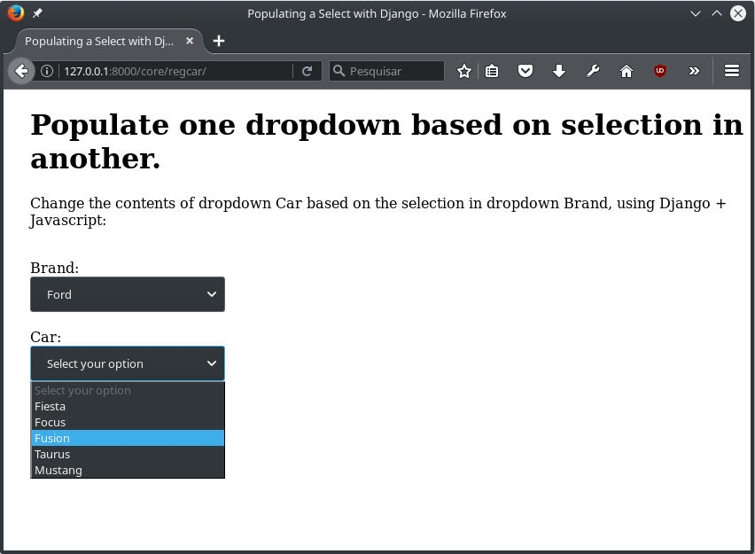

===============================
``drd`` - Django Dropdown Related
===============================

Description
-----------
How to populate the options of a select element, based in selection on another with Django. In this solution,
I used pure javascript and Jquery. For tranSport data from django to JS, json format is used.

Requiriments
------------

::

    Django 1.10.5

Environment:
------------
    linux

Usage
-----
   ./manage runserver

